# Overview

This project implements two different closed-loop balancing systems using an Arduino, ultrasonic sensor, and servo motor to stabilize/center objects on a beam.

Two different controller implementations were developed:

- A **Ball Balancing System**
- A **Block Balancing System**

The first system uses PD-based and second uses PID-based feedback control. Both use filtered ultrasonic sensor measurements to continuously adjust beam angle and stabilize the object near the center of the beam.

---

# Final Systems

## Ball Balancing System
There was a region of unusable distance readings near the center of the beam so a slightly offset center was chosen. An explanation of this can be found in section 4 - Major System Limitation.



<!-- <iframe width="560" height="315"
  src="https://www.youtube.com/embed/3KzywV7yYKY"
  title="Ball Balancer - PD Controller"
  frameborder="0"
  allow="accelerometer; autoplay; clipboard-write; encrypted-media; gyroscope; picture-in-picture"
  allowfullscreen>
</iframe> -->

---

## Block Balancing System
Theres was lots of friction with this version. There was much more friction moving toward the sensor than away from it.



<!-- <iframe width="560" height="315"
  src="https://www.youtube.com/embed/xR2-8JAKccs"
  title="Block Balancer - PID Controller"
  frameborder="0"
  allow="accelerometer; autoplay; clipboard-write; encrypted-media; gyroscope; picture-in-picture"
  allowfullscreen>
</iframe> -->

---


## Individual 3D Printed Components


## STL Files

- [Download Base STL](STL_Files/Base.stl)
- [Download Balance Beam STL](STL_Files/Balance_Beam.stl)
- [Download Servo Connector Arm STL](STL_Files/Servo_ExtensionArm.stl)
- [Download 100mm Connector STL](STL_Files/100mm_Connector.stl)
- [Download Full Assembly STL](STL_Files/Assembly.stl)

## Full CAD Assembly

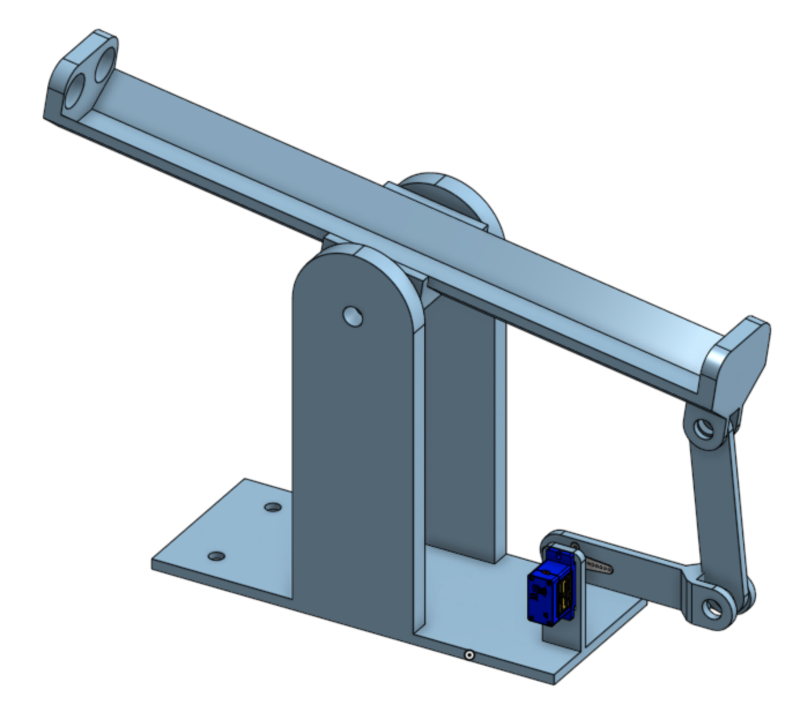{#fig-assembly fig-cap-location="top"}

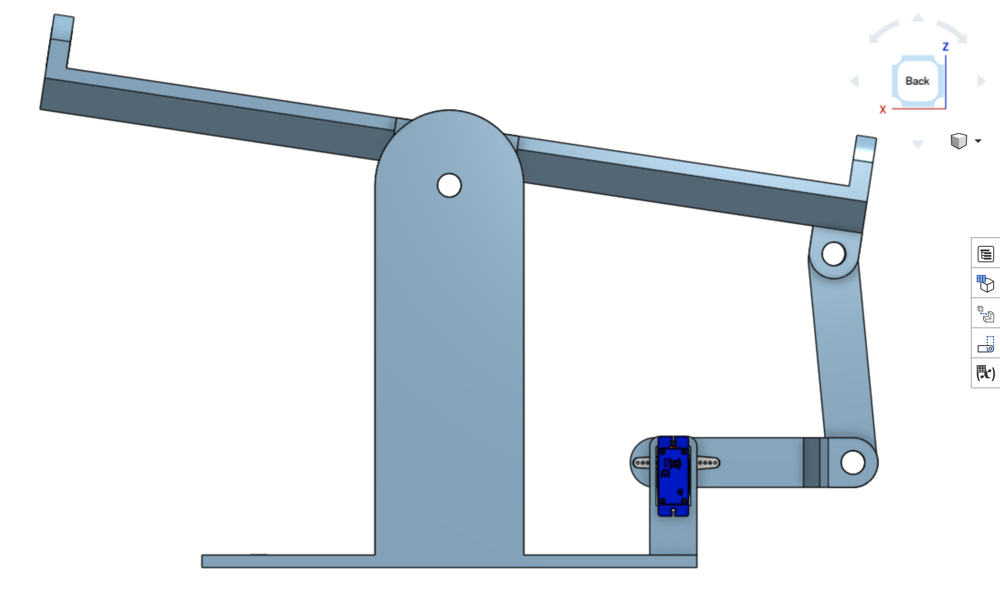

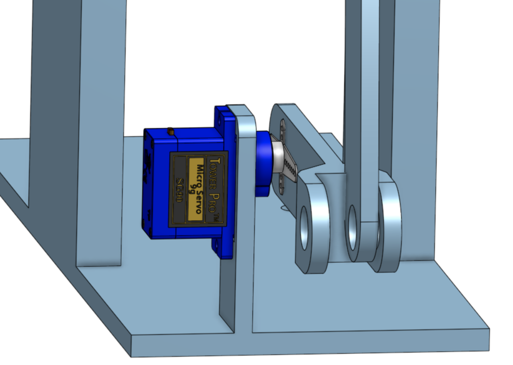

### Base
Includes Servo connector and holes for glueing standoffs

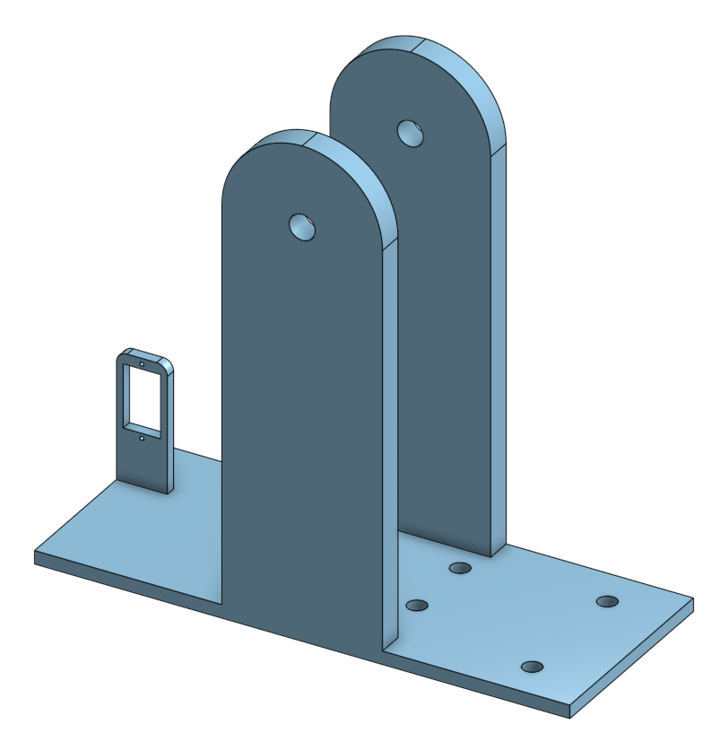

---

### Beam

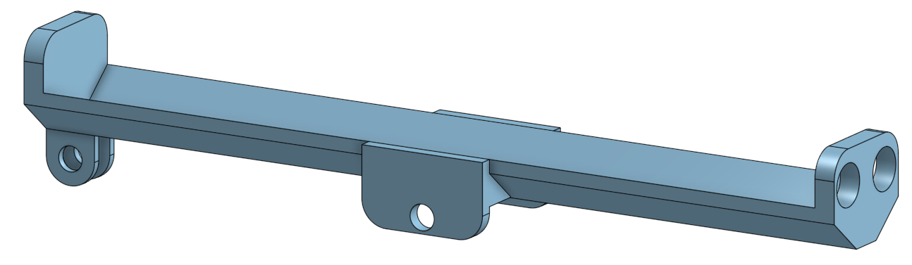

---

### Servo Arm Connector Extension

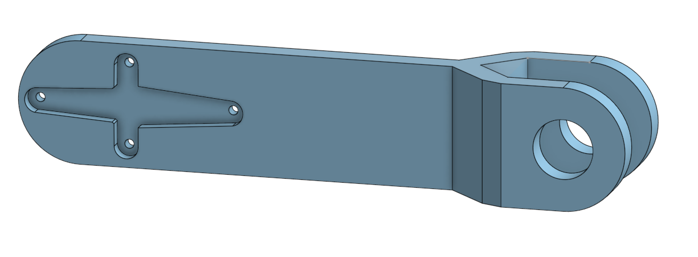

---

### Servo Extender to Beam Connector

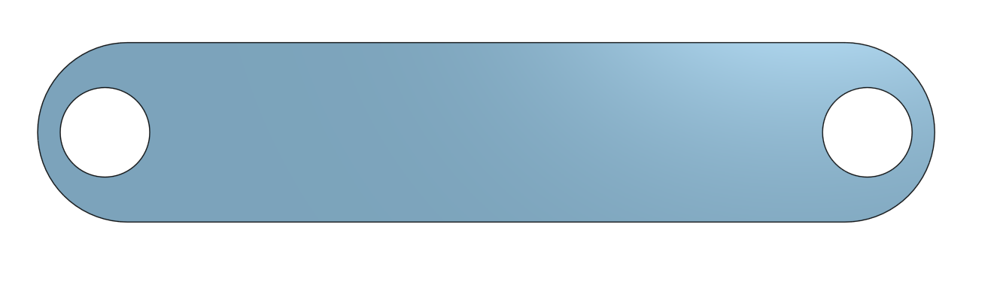

---

## Other Components

### 3/8 Steel Rod
3 segments cut to:

- 80 cm
- 20 cm
- 15 cm 

Inserted through plastic holes and used as pivots

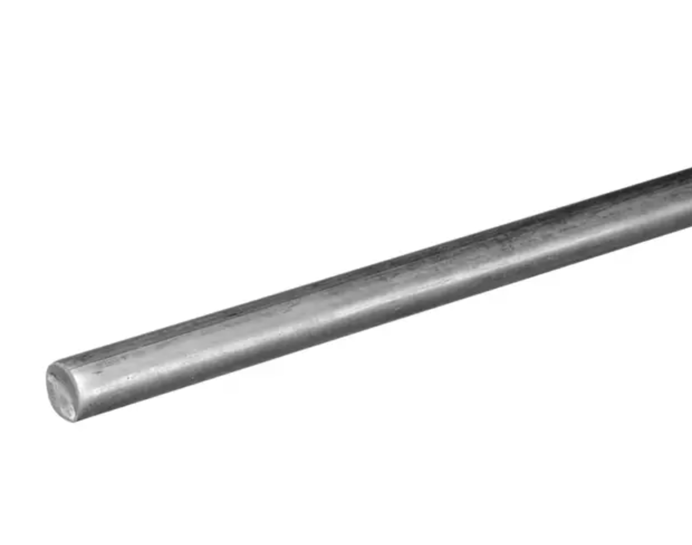

---

### Servo Motor & Arm

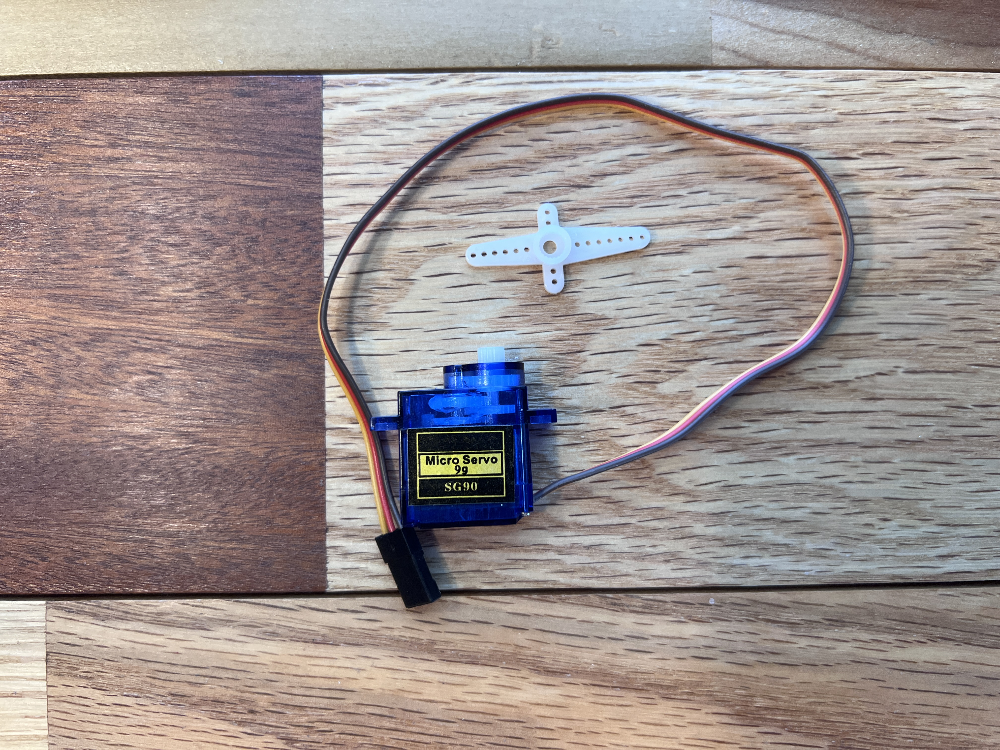

---

### Ultrasonic Sensor

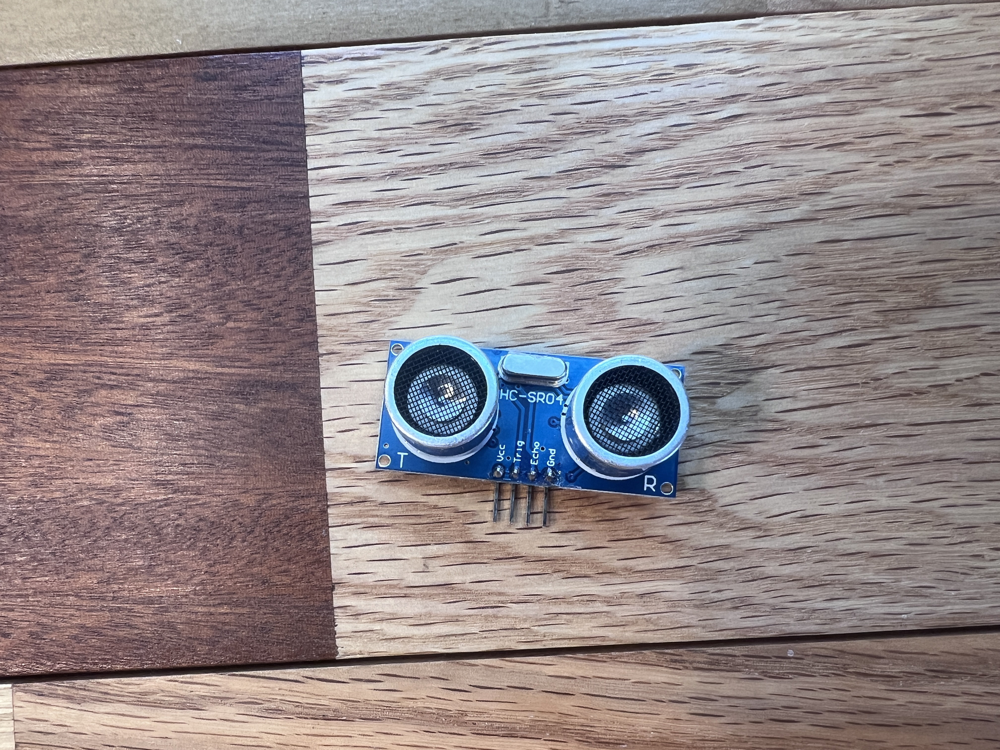

---

### Arduino Uno & Breadboard

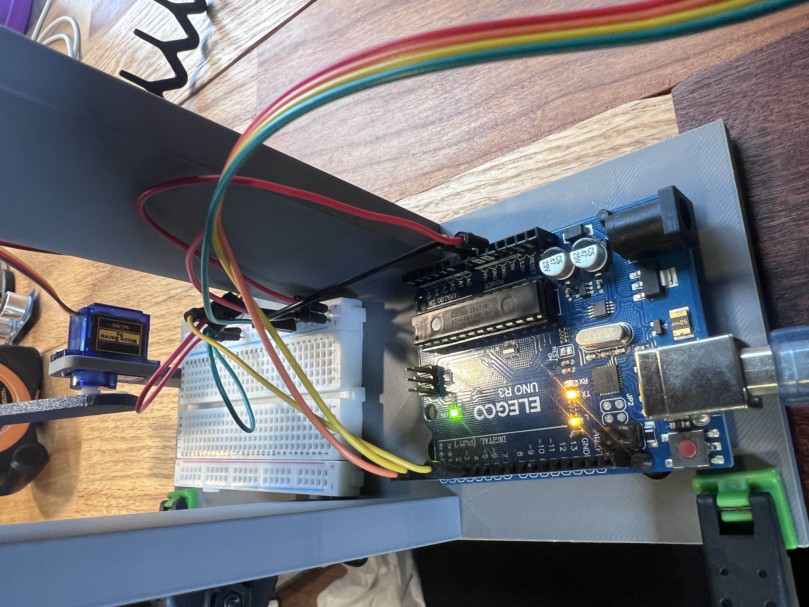

---

### Standoff Screws & Nuts  (M3*6+6) & (M3)

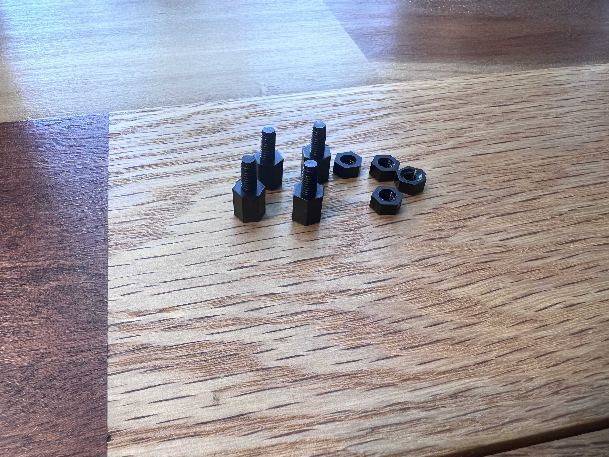

---

## Pin Connections

- **Arduino Uno**
  - USB $\to$ Computer
  - GND $\to$ Common Breadboard Ground
  - 5V $\to$ Common Breadboard Power

- **HC-SR04 Ultrasonic Sensor**
  - VCC $\to$ 5V
  - GND $\to$ GND
  - TRIG $\to$ D2
  - ECHO $\to$ D3

- **Servo Motor**
  - Signal Wire $\to$ D5
  - Power (Red) $\to$ 5V
  - Ground (Brown/Black) $\to$ GND

---

# Major System Limitation

The largest limitation encountered in the project was the behavior of the ultrasonic sensor when the stress ball was near the center of the beam.

A sketch was made specifically to output the ultrasonic sensors filtered distance measurements (3 sample median filter). The sensor behaved normally until the ball approached the center region of the beam.

At approximately 16.25 cm (2.5–3 cm away from the center position on the non-sensor side), the measured readings became inaccurate and unusable.

For example:

- The ball would approach the center normally from the far end to about 16.25 cm away from the sensor.
- After 16.25 cm, as the ball moved slightly closer to center, the measured destance would increase to about 17.25cm
- Additional movement toward center produced repeated inaccurate readings of either 16.25 or 17.25cm with occasional readings in the 20–30 cm range
- Once the ball crossed a threshold point at about 10.25 cm away from the sensor, the measured value would suddenly drop back to realistic values.
- The readings would remain accurate from 10.25 cm until the ball touched the sensor.

This created a large “dead zone” where the ultrasonic readings did not correspond to the true ball position.

```{mermaid}
flowchart LR

A["Far Wall<br>(~26 cm)"]

B["Normal Readings<br>26 cm $\to$ 16.25 cm"]

C["**BAD SENSOR READINGS** <br> Typically 16.25 cm or <br> 17.25 cm readings <br> 16.25 cm $\to$ 10.25 cm"]

D["Normal Readings<br>10.25 cm $\to$ 0 cm"]

E["Sensor<br>(0 cm)"]

A --> B --> C --> D --> E

style B fill:#b6f2b6,stroke:#222,stroke-width:2px
style C fill:#ffb3b3,stroke:#222,stroke-width:3px
style D fill:#b6f2b6,stroke:#222,stroke-width:2px
```

The issue was especially problematic because the objective of a PID ball balancing system is to stabilize the ball precisely at the center of the beam.

As a workaround, A new "Center" value of 16.25 cm was chosen to avoid the center being in the "Bad Sensor Readings" region.

- Actual beam center: approximately 12.5 cm (16 cm center - 3.5 cm ball radius)
- Actual center value used: 16.26 cm

```{mermaid}
flowchart LR

A["Far Wall<br>(~26 cm)"]

B["Normal Readings<br>26 cm $\to$ 16.25 cm"]

C["**NEW CENTER** <br> Right Before Bad Sensor Readings Zone<br>16.26 cm"]

D["**BAD SENSOR READINGS** <br> Typically 16.25 cm or <br> 17.25 cm readings <br> 16.25 cm $\to$ 10.25 cm"]

E["Normal Readings<br>10.25 cm $\to$ 0 cm"]

F["Sensor<br>(0 cm)"]

A --> B --> C --> D --> E --> F

style B fill:#b6f2b6,stroke:#222,stroke-width:2px
style C fill:#fff2a8,stroke:#222,stroke-width:2px
style D fill:#ffb3b3,stroke:#222,stroke-width:3px
style E fill:#b6f2b6,stroke:#222,stroke-width:2px
```

This allowed the system to balance reliably despite the sensor limitations, but at a position not directly in the center of the beam

The problem most likely originates from:

- Ultrasonic Sensor Inaccuracies
- Reflection angle changes near beam center
- Ball curvature
- Noise reflections from Base/Beam Bodies

---

# Ball Balancing Code

The ball balancing implementation uses a PD controller with filtering, gain scheduling, and servo rate limiting.


## Full Ball Balancing Code

```cpp
/* Ball on Beam PD Balancer
by Jacob Maier

Description:
This program centers a 3.5cm radius Stress Ball I got from my school on a beam. It
uses an ultrasonic sensor to detect ball distance, and a servo to change the beam angle.
The physical system was 3D printed for accuracy and controllability.

Important note: 
This code centers the ball slightly to the non sensor side of center. See website for why
this was done.*/


#include <Servo.h>                                     // Arduino servo library

Servo servo;                                           // Create servo object

#define trig 2                                         // Ultrasonic trigger pin
#define echo 3                                         // Ultrasonic echo pin

#define servoPin 5                                     // Servo signal pin

// ==========================================================
// SERVO
// ==========================================================
const int SERVO_CENTER = 90;                           // Beam level angle

const int SERVO_MIN = 70;                              // Set the min angle (-20)
const int SERVO_MAX = 110;                             // Set the max angle (+20)

const float MAX_SERVO_STEP = 4.0;                      // Maximum servo movement per loop

const int HOLD_DISTANCE = 2.50;                        // Allowed position error for HOLD mode
const int HOLD_VELOCITY = 5.5;                         // Allowed velocity for HOLD mode

// ==========================================================
// SERVO ASYMMETRY COMPENSATION
// ==========================================================

const float BELOW_CENTER_SCALE = 0.80;                 // Compress servo angle change below center
const float ABOVE_CENTER_SCALE = 1.00;                 // Keep normal scaling above center

// ==========================================================
// CENTER
// ==========================================================
// actual physical beam center
const float CENTER_CM = 16.26;                         // Physical beam center in cm

// old compensation center
//const float CENTER_CM = 15.7;

// ==========================================================
// PD
// ==========================================================
// const float KP = 1.85;
// const float KD = 1.05;
const float KP = 1.85;                                 // Proportional gain
const float KD = 1.05;                                 // Derivative gain

// ==========================================================
// FILTERING
// ==========================================================
float filteredPos = CENTER_CM;                         // Initialize filtered position to center cm

float previousPos = CENTER_CM;                         // Initialize previous position to center cm

float filteredVelocity = 0;                            // Initialize filtered velocity to 0

float servoCommand = SERVO_CENTER;                     // Initialize servo command to center angle

float lastRaw = CENTER_CM;                             // Initialize previous raw reading to center cm

unsigned long lastTime = 0;                            // Initialize timing variable

// ==========================================================

void setup()
{
  pinMode(trig, OUTPUT);                               // Set ultrasonic trig pin as output
  pinMode(echo, INPUT);                                // Set ultrasonic echo pin as input

  servo.attach(servoPin);                              // Attach servo to signal pin

  Serial.begin(9600);                                  // Start serial monitor at baud rate 9600

  servo.write(SERVO_CENTER);                           // Move servo to center angle

  delay(1000);                                         // Delay 1 second for startup stabilization

  lastTime = millis();                                 // Start timing reference
}

// ==========================================================

void loop()
{
  controlBall();                                       // Main ball balancing control function

  delay(18);                                           // Main loop delay
}

// ==========================================================
// ULTRASONIC
// ==========================================================
float distanceCM()
{
  digitalWrite(trig, LOW);                             // Stop ultrasonic pulse
  delayMicroseconds(3);                                // Small delay before trigger

  digitalWrite(trig, HIGH);                            // Send ultrasonic pulse
  delayMicroseconds(10);                               // 10 microsecond pulse

  digitalWrite(trig, LOW);                             // Stop ultrasonic pulse

  unsigned long duration = pulseIn(echo, HIGH, 18000); // Measure return pulse duration

  if (duration == 0)                                   // If timeout occurs
  {
    return -1;                                         // Return invalid reading
  }

  return duration / 58.0;                              // Convert pulse duration to cm
}

// ==========================================================
// MEDIAN FILTER
// ==========================================================
float readDistance()
{
  float a = distanceCM();                              // First sensor reading
  delay(2);                                            // Small spacing delay

  float b = distanceCM();                              // Second sensor reading
  delay(2);                                            // Small spacing delay

  float c = distanceCM();                              // Third sensor reading

  if ((a <= b && b <= c) || (c <= b && b <= a))       // If second reading is median
  {
    return b;                                          // Return middle value
  }

  if ((b <= a && a <= c) || (c <= a && a <= b))       // If first reading is median
  {
    return a;                                          // Return middle value
  }

  return c;                                            // Otherwise c is the median
}

// ==========================================================
// MAIN CONTROL
// ==========================================================
void controlBall()
{
  float raw = readDistance();                          // Get median filtered ultrasonic reading

  if (raw < 2 || raw > 50)                             // Reject impossible readings
  {
    servo.write(SERVO_CENTER);                         // Set servo angle to center angle
    return;                                            // Exit control loop
  }

  // ========================================================
  // SPIKE LIMITER
  // ========================================================
  float deltaRaw = raw - lastRaw;                      // Calculate change in sensor reading

  deltaRaw = constrain(deltaRaw, -2.0, 2.0);           // Limit maximum reading jump per loop

  raw = lastRaw + deltaRaw;                            // Apply constrained reading change

  lastRaw = raw;                                       // Save filtered raw value

  // ========================================================
  // POSITION FILTER
  // ========================================================
  filteredPos = filteredPos * 0.3 + raw * 0.7;         // Low pass filter / exponential moving average

  // ========================================================
  // CHANGE IN TIME (dt)
  // ========================================================
  unsigned long now = millis();                        // Get current time

  float dt = (now - lastTime) / 1000.0;                // Calculate change in time (seconds)

  lastTime = now;                                      // Update timing variable

  if (dt <= 0)                                         // Prevent divide-by-zero
  {
    dt = 0.018;                                        // Set minimum possible dt
  }

  // ========================================================
  // VELOCITY
  // ========================================================
  float rawVelocity = (filteredPos - previousPos) / dt; // Calculate velocity (dx/dt)

  previousPos = filteredPos;                           // Save current position for next loop

  filteredVelocity = filteredVelocity * 0.75 + rawVelocity * 0.25; // Smooth velocity estimate

  filteredVelocity = constrain(filteredVelocity, -10, 10); // Constrain max velocity estimate

  if (abs(filteredVelocity) < 0.8)                     // Remove tiny velocity noise
  {
    filteredVelocity = 0;                              // Set tiny velocity to 0
  }

  // ========================================================
  // ERROR
  // ========================================================
  float error = filteredPos - CENTER_CM;               // Calculate error from center position

  float absError = abs(error);                         // Absolute value of error

  // ========================================================
  // HOLD ZONE
  // ========================================================
  if (absError < HOLD_DISTANCE && abs(filteredVelocity) < HOLD_VELOCITY) // If close enough to center
  {
    // Slowly relax servo toward level
    servoCommand = servoCommand * 0.985 + SERVO_CENTER * 0.015; // Slowly return servo to level

    servo.write((int)servoCommand);                    // Send servo command

    Serial.print("HOLD ");                             // Print hold mode status

    Serial.print("err: ");                             // Print error label
    Serial.print(error);                               // Print error value

    Serial.print(" vel: ");                            // Print velocity label
    Serial.print(filteredVelocity);                    // Print velocity value

    Serial.print(" servo: ");                          // Print servo label
    Serial.println((int)servoCommand);                 // Print servo command

    return;                                            // Exit control loop
  }

  // ========================================================
  // GAIN SCHEDULING
  // ========================================================
  float kp = KP;                                       // Copy proportional gain
  float kd = KD;                                       // Copy derivative gain

  if (absError < HOLD_DISTANCE)                        // Disable corrections inside hold region
  {
    kp *= 0;                                           // Zero proportional gain
    kd *= 0;                                           // Zero derivative gain
  }

  // ========================================================
  // ULTRA FINE REGION
  // ========================================================
  else if (absError < 1.8)                             // Very close to center
  {
    kp *= 0.42;                                        // Reduce proportional aggression
    kd *= 1.9;                                         // Increase damping
  }

  // ========================================================
  // NORMAL FINE REGION
  // ========================================================
  else if (absError < 5.0)                             // Moderately close to center
  {
    kp *= 0.55;                                        // Slightly reduce proportional gain
    kd *= 1.55;                                        // Increase derivative damping
  }

  // ========================================================
  // FAR REGION
  // ========================================================
  else if (absError > 5.0)                             // Far from center
  {
    kp *= 1.05;                                        // Slightly stronger proportional correction
    kd *= 0.90;                                        // Slightly reduce damping
  }

  // ========================================================
  // PD CONTROL
  // ========================================================
  float control = kp * error + kd * filteredVelocity;  // Compute PD controller output

  // ultra fine control limits
  if (absError < 0.8)                                  // Very close to center
  {
    control = constrain(control, -4, 4);               // Small control range
  }

  // near center limits
  else if (absError < 1.5)                             // Near center
  {
    control = constrain(control, -7, 7);               // Medium control range
  }

  // normal limits
  else
  {
    control = constrain(control, -18, 18);             // Full control range
  }

  // ========================================================
  // TARGET SERVO
  // ========================================================
  float targetServo = SERVO_CENTER - control;          // Convert controller output into servo angle

  // ========================================================
  // ASYMMETRIC MECHANICAL COMPENSATION
  // ========================================================
  // Lower servo angles are mechanically stronger,
  // so compress movement below center slightly.
  float servoOffset = targetServo - SERVO_CENTER;      // Calculate offset from center angle

  if (servoOffset < 0)                                 // If servo moves below center
  {
    servoOffset *= BELOW_CENTER_SCALE;                 // Compress movement below center
  }

  else
  {
    servoOffset *= ABOVE_CENTER_SCALE;                 // Apply normal scaling above center
  }

  targetServo = SERVO_CENTER + servoOffset;            // Rebuild final servo angle

  // ========================================================

  targetServo = constrain(                              // Keep servo angle inside safe limits
    targetServo,
    SERVO_MIN,
    SERVO_MAX
  );

  // ========================================================
  // SERVO RATE LIMIT
  // ========================================================
  float maxServoStep = MAX_SERVO_STEP;                 // Default maximum servo movement per loop

  // ultra calm near center
  if (absError < 0.8)                                  // Very close to center
  {
    maxServoStep = 1.2;                                // Extremely slow movement
  }

  // slower near center
  else if (absError < 1.5)                             // Near center
  {
    maxServoStep = 1.8;                                // Slower movement
  }

  float deltaServo = targetServo - servoCommand;       // Desired servo movement amount

  deltaServo = constrain(deltaServo, -maxServoStep, maxServoStep); // Limit servo movement speed

  servoCommand += deltaServo;                          // Apply limited servo movement

  servo.write((int)servoCommand);                      // Send servo command

  // ========================================================
  // DEBUG
  // ========================================================
  Serial.print("raw: ");                               // Print raw distance label
  Serial.print(raw);                                   // Print raw distance

  Serial.print(" err: ");                              // Print error label
  Serial.print(error);                                 // Print error value

  Serial.print(" vel: ");                              // Print velocity label
  Serial.print(filteredVelocity);                      // Print velocity value

  Serial.print(" servo: ");                            // Print servo label
  Serial.println((int)servoCommand);                   // Print servo command
}
```

---

# Block Balancing Code

The block balancing implementation uses a PID controller with filtering, gain scheduling, and servo rate limiting.


## Full Block Balancing Code

```cpp
/* 
Block on Beam PID Balancer
by Jacob Maier
May 25, 2026

Description:
PID controller for sliding block on balance beam. The block introduces far greater friction
than the ball, but its flat face facing the ultrasonic sensor produced more accurate distance 
readings. With the ball, there was a region of unusable distance readings from approximately 
16.25 --> 10.25cm (beam center was within this range).*/

#include <Servo.h>                                      // Arduino servo library

Servo servo;                                            // Create a servo object

// ==========================================================
// PINS
// ==========================================================
#define trig 2                                          // Ultrasonic trigger pin
#define echo 3                                          // Ultrasonic echo pin
#define servoPin 5                                      // Servo signal pin

// ==========================================================
// SERVO SETTINGS
// ==========================================================
const int SERVO_CENTER = 90;                            // Level beam position angle
const int SERVO_MIN = 50;                               // Minimum servo angle
const int SERVO_MAX = 130;                              // Maximum servo angle

// ==========================================================
// CENTER POSITION
// ==========================================================
const float CENTER_CM = 15.43;                          // Centered block position in cm

// ==========================================================
// HOLD ZONE
// ==========================================================
const float HOLD_DISTANCE = 0.55;                       // Allowed position error for hold mode
const float HOLD_VELOCITY = 1.0;                        // Allowed velocity for hold mode

// ==========================================================
// PID GAINS
// ==========================================================
float KP = 5.5;                                         // Proportional (error in cm) gain
float KI = 3.5;                                         // Integral gain (deals with sticking from friction)
float KD = 0.45;                                        // Derivative/velocity gain

// ==========================================================
// SHAKE SETTINGS
// ==========================================================
const float SHAKE_AMOUNT = 14.0;                        // Shake strength to break friction
const float STUCK_ERROR = 0.6;                          // Error needed before shake activates (only needed near center)
const float STUCK_VELOCITY = 0.12;                      // Velocity threshold for detecting stuck block

// ==========================================================
// HOLD LATCH
// ==========================================================
bool holdActive = false;                                // Tracks whether HOLD mode is active

// ==========================================================
// FILTERING STATE
// ==========================================================
float filteredPos = CENTER_CM;                          // Smoothed position value
float filteredVelocity = 0;                             // Smoothed velocity value
float previousPos = CENTER_CM;                          // Previous filtered position

float integral = 0;                                     // PID integral accumulator

float servoCommand = SERVO_CENTER;                      // Smoothed servo output command
float lastRaw = CENTER_CM;                              // Previous raw sensor reading

unsigned long lastTime = 0;                             // Last loop timestamp

// shake state
bool shakeDirection = false;                            // Current shake direction
unsigned long lastShakeToggle = 0;                      // Last shake direction toggle time

// ==========================================================
// SETUP
// ==========================================================
void setup()
{
  pinMode(trig, OUTPUT);                                // Set trigger pin as output
  pinMode(echo, INPUT);                                 // Set echo pin as input

  servo.attach(servoPin);                               // Attach servo to output pin
  servo.write(SERVO_CENTER);                            // Start servo at beam level

  Serial.begin(9600);                                   // Start serial monitor

  delay(1000);                                          // Delay to allow hardware to stabilize
  lastTime = millis();                                  // Initialize the timing reference
}

// ==========================================================
// MAIN LOOP
// ==========================================================
void loop()
{
  controlBlock();                                       // Run main balancing controller
  delay(10);                                            // Small loop delay for stability
}

// ==========================================================
// ULTRASONIC
// ==========================================================
float distanceCM()
{
  digitalWrite(trig, LOW);                              // Trigger starts low
  delayMicroseconds(3);                                 // Short settling delay

  digitalWrite(trig, HIGH);                             // Send ultrasonic pulse
  delayMicroseconds(10);                                // 10us trigger pulse length

  digitalWrite(trig, LOW);                              // End trigger pulse

  unsigned long duration = pulseIn(echo, HIGH, 18000);  // Measure echo pulse duration

  if (duration == 0)                                    // Invalid reading
  {
    return -1;                                          // Return invalid reading on timeout
  }

  return duration / 58.0;                               // Convert pulse duration to cm distance
}

// ==========================================================
// MEDIAN FILTER
// ==========================================================
float readDistance()
{
  float a = distanceCM();                               // First sensor reading
  delay(2);                                             // Short spacing delay

  float b = distanceCM();                               // Second sensor reading
  delay(2);                                             // Short spacing delay

  float c = distanceCM();                               // Third sensor reading

  if ((a <= b && b <= c) || (c <= b && b <= a)) 
  {
    return b; // Return median value
  }

  if ((b <= a && a <= c) || (c <= a && a <= b)) 
  {
    return a; // Return median value
  }

  return c;                                             // Return remaining median value
}

// ==========================================================
// MAIN CONTROL
// =========================================================
void controlBlock()
{
  float raw = readDistance();                           // Get filtered sensor distance

  if (raw < 2 || raw > 50)                              // Reject impossible readings
  {
    servo.write(SERVO_CENTER);                          // Return beam to center
    return;                                             // Skip control update
  }

  // ========================================================
  // SPIKE LIMITER
  // ========================================================
  float deltaRaw = raw - lastRaw;                       // Calculate sensor jump
  deltaRaw = constrain(deltaRaw, -1.0, 1.0);            // Limit sudden spikes

  raw = lastRaw + deltaRaw;                             // Apply limited change
  lastRaw = raw;                                        // Store latest stable reading

  // ========================================================
  // POSITION FILTER (less aggressive than before)
  // ========================================================
  filteredPos = filteredPos * 0.65 + raw * 0.35;        // (EMA) Low-pass filter for position

  // ========================================================
  // TIME
  // ========================================================
  unsigned long now = millis();                         // Current loop time
  float dt = (now - lastTime) / 1000.0;                 // Convert loop time step to seconds
  lastTime = now;                                       // Save current time

  if (dt <= 0) dt = 0.01;                               // Prevent divide-by-zero

  // ========================================================
  // VELOCITY (more responsive)
  // ========================================================
  float rawVelocity = (filteredPos - previousPos) / dt; // Calculate velocity
  previousPos = filteredPos;                            // Store current position

  filteredVelocity = filteredVelocity * 0.55 + rawVelocity * 0.45; // Smooth velocity (EMA Filter)

  if (abs(filteredVelocity) < 0.12)                     // Ignore small noise motion
  {
    filteredVelocity = 0;                               // Snap near-zero velocity to zero
  }

  // ========================================================
  // ERROR
  // ========================================================
  float error = filteredPos - CENTER_CM;                // Error = Distance from center
  float absError = abs(error);                          // Absolute magnitude of error

  // ========================================================
  // HOLD ZONE (latched)
  // ========================================================
  if (!holdActive)                                      // If not already holding
  {
    if (absError < HOLD_DISTANCE && abs(filteredVelocity) < HOLD_VELOCITY) // If both hold parameters are met
    {
      holdActive = true;                                // Enter hold mode
    }
  }
  else
  {
    // EXIT CONDITION (resulting from REAL motion, NOT noise)
    if (absError > (HOLD_DISTANCE + 0.25))              // Exit hold if block drifts out of hold zone
    {
      holdActive = false;                               // Disable hold mode
    }

    else                                                // Prevents noise from ruining suuccessful HOLD state
    {
      // stay locked in HOLD
      integral = 0;                                     // Reset integral term
      filteredVelocity = 0;                             // Zero velocity estimate
      previousPos = filteredPos;                        // Prevent velocity spike

      servoCommand = SERVO_CENTER;                      // Hold beam level
      servo.write(SERVO_CENTER);                        // Send center command

      Serial.println("HOLD");                           // Debug output
      return;                                           // Skip remaining control
    }
  }

  // ========================================================
  // INTEGRAL (avoiding windup)
  // ========================================================
  if (!(absError < HOLD_DISTANCE))                      // Only integrate when outside the hold zone
  {
    integral += error * dt;                             // Accumulate integral error
    integral = constrain(integral, -8, 8);              // P\Constrain integral to prevent integral windup
  }

  // ========================================================
  // PID
  // ========================================================
  float control = KP * error + KI * integral + KD * filteredVelocity; // PID output

  control = constrain(control, -40, 40);               // Limit the control strength

  // ========================================================
  // MIN FORCE TO OVERCOME STATIC FRICTION
  // ========================================================
  if (abs(control) > 0 && abs(control) < 6)            // If a command is too weak
  {
    control = (control > 0) ? 6 : -6;                  // Force a minimum amount of movement
  }

  // ========================================================
  // TARGET SERVO
  // ========================================================
  float targetServo = SERVO_CENTER - control;          // Convert PID output to servo angle

  // ========================================================
  // SHAKE MODE (adaptive frequency)
  // ========================================================
  bool shakeMode = false;                               // Track shake mode state

  if (!holdActive && absError > STUCK_ERROR && abs(filteredVelocity) < STUCK_VELOCITY)  // if shake mode conditions are met
  {
    shakeMode = true;                                   // Enable shake mode

    // ======================================================
    // Adaptive shake timing:
    // slower near center, faster when more stuck
    // ======================================================
    float centerFactor = 1.0 - constrain(absError / 10.0, 0.0, 1.0); // Distance scaling

    // near center --> ~60–90ms (slower and more controlled)
    // far from center --> ~18–30ms (faster for stronger breakaway)

    unsigned long shakeInterval = 18 + (unsigned long)(centerFactor * 70); // Calculate the shake speed

    if (millis() - lastShakeToggle > shakeInterval)     // Time to switch direction
    {
      shakeDirection = !shakeDirection;                 // Flip shake direction
      lastShakeToggle = millis();                       // Save toggle time
    }

    // ======================================================
    // Bias still helps overcome asymmetry
    // ======================================================
    float bias = (error > 0) ? 14.0 : 10.0;             // Directional shake bias

    if (shakeDirection)
      targetServo += bias;                              // Shake one direction
    else
      targetServo -= bias;                              // Shake opposite direction
  }

  // ========================================================
  // LIMITS
  // ========================================================
  targetServo = constrain(targetServo, SERVO_MIN, SERVO_MAX); // Keep servo within angle limites

  // ========================================================
  // SERVO OUTPUT (fast response = less static friction lock)
  // ========================================================
  if (shakeMode)
  {
    servoCommand = targetServo;                         // Direct the output during shaking
  }
  else
  {
    servoCommand = servoCommand * 0.05 + targetServo * 0.95; // Smooth normal movement
  }

  servo.write((int)servoCommand);                       // Send final servo command

  // ========================================================
  // SERIAL MONITOR DEBUGGING
  // ========================================================
  Serial.print("pos:");                                 // Print position label
  Serial.print(filteredPos);                            // Print filtered position

  Serial.print(" err:");                                // Print error label
  Serial.print(error);                                  // Print position error

  Serial.print(" vel:");                                // Print velocity label
  Serial.print(filteredVelocity);                       // Print filtered velocity

  Serial.print(" servo:");                              // Print servo label
  Serial.println((int)servoCommand);                    // Print servo output
}
```

# Debugging Set Angle Code

Allows user to set servo angle for finding level or any other purpose.


## Set Angle Code

```cpp
#include <Servo.h>
Servo servo;

void setup() {
  servo.attach(5);
}

void loop() {
  servo.write(90);
}
```

# Debugging Distance Output Code

Allows user to view JUST the 3 sample median filtered distance in the serial monitor. Removes all the movement and makes it easy to find center or find regions of unusable distance readings.

Best used after using the above Set Angle code to set the beam to level.


## Distance Code

```cpp
#define trig 2
#define echo 3

void setup()
{
  pinMode(trig, OUTPUT);
  pinMode(echo, INPUT);

  Serial.begin(9600);
}

void loop()
{
  float distance = readDistance();

  Serial.print("Distance: ");
  Serial.print(distance);
  Serial.println(" cm");

  delay(100);
}

// ========================================
// SINGLE ULTRASONIC READING
// ========================================

float distanceCM()
{
  digitalWrite(trig, LOW);
  delayMicroseconds(3);

  digitalWrite(trig, HIGH);
  delayMicroseconds(10);

  digitalWrite(trig, LOW);

  unsigned long duration = pulseIn(echo, HIGH, 18000);

  if (duration == 0)
  {
    return -1;
  }

  return duration / 58.0;
}

// ==========================================================
// MEDIAN FILTER
// ==========================================================

float readDistance()
{
  float a = distanceCM();
  delay(2);

  float b = distanceCM();
  delay(2);

  float c = distanceCM();

  if ((a <= b && b <= c) || (c <= b && b <= a))
    return b;

  if ((b <= a && a <= c) || (c <= a && a <= b))
    return a;

  return c;
}
```